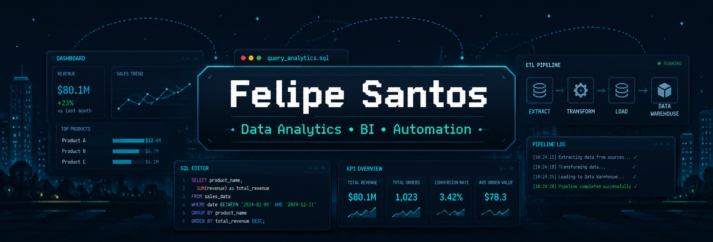

## About Me

- 🎓 Information Systems student at USP
- 📊 Focused on operational analytics, process automation and business intelligence solutions
- ⚡ Experience with Power BI, SQL Server, Python and ETL
- 🚀 Designing data-driven solutions focused on operational efficiency and decision-making
- 📍 Brazil

---

## Current Focus

- 📈 Building analytics projects with Power BI and SQL
- ⚡ Developing ETL and automation solutions with Python
- 🚀 Studying Data Engineering and AI applications

---

## Tech Stack

## Connect With Me

